# Creating Diagrams

Comprehensive guide for creating new diagrams following DDD principles.

## Before You Start

**REQUIRED**: Read `DDD_PRINCIPLES.md` before creating any diagram. Understanding DDD methodology is essential.

## Creation Process

### 1. Understand the User Need

Before writing any Mermaid code, answer these questions:
- What user problem does this solve?
- What value does it deliver to users?
- What user actions trigger this flow?
- What user outcomes result from this flow?

### 2. Choose the Right Diagram Type

**Feature Diagrams** (`feature-*.md`)
- Use for: Specific features or user workflows
- Shows: How a feature delivers user value
- Format: Flowchart with Front-Stage/Back-Stage subgraphs

**Sequence Diagrams** (`sequence-*.md`)
- Use for: Time-based user journeys
- Shows: Step-by-step interaction over time
- Format: Sequence diagram with user as primary actor

**Architecture Diagrams** (`arch-*.md`)
- Use for: System-level organization
- Shows: Major components and their relationships
- Format: High-level flowchart with impact annotations

**Flow Diagrams** (`flow-*.md`)
- Use for: Process flows and decision trees
- Shows: Branching logic and outcomes
- Format: Flowchart with decision nodes

**Test Coverage Diagrams** (`test-*.md`)
- Use for: Documenting test strategy
- Shows: What user scenarios are protected by tests
- Format: Flowchart connecting tests to user value

**Refactoring Diagrams** (in `refactoring/`)
- Use for: Before/After comparisons
- Shows: Improvements to user experience
- Format: Side-by-side diagrams with changes in #90EE90

### 3. Determine the Directory

```
ai/diagrams/
├── features/        # Feature-specific user flows
├── architecture/    # System-level diagrams
├── journeys/        # User journey sequences
├── tests/           # Test coverage and strategy
└── refactoring/     # Before/After improvements
```

### 4. Create the File Structure

Use this template for all diagrams:

```markdown
# [Clear, User-Focused Title]

**Type:** [Feature Diagram | Sequence Diagram | Architecture Diagram | Flow Diagram | Test Coverage]
**Last Updated:** [YYYY-MM-DD]
**Related Files:**
- `path/to/implementation.ts`
- `path/to/component.tsx`
- `path/to/test.spec.ts`

## Purpose

[1-2 sentences describing what user value this diagram illustrates. Focus on user benefit, not technical implementation.]

## Diagram

\`\`\`mermaid
[Mermaid code here - see patterns below]
\`\`\`

## Key Insights

- **User Impact 1:** [How this affects user experience]
- **User Impact 2:** [What value this delivers]
- **Technical Enabler:** [What makes the above possible]

## Change History

- **YYYY-MM-DD:** Initial creation
```

### 5. Write the Mermaid Code

Follow these patterns based on diagram type:

## Diagram Patterns

### Feature Diagram Pattern

```mermaid
graph TD
    subgraph "Front-Stage (User Experience)"
        User[User Action] --> UI[UI Response ⚡ Impact]
        UI --> Feedback[User Feedback ✅ Impact]
    end

    subgraph "Back-Stage (Implementation)"
        UI --> Service[Service Layer 🛡️ Impact]
        Service --> DB[(Database 💾 Impact)]
        Service --> Cache[Cache Layer ⚡ Impact]
    end

    DB --> Success[Success State]
    Service -->|Error| ErrorHandler[Error Handler 🔄 Impact]
    ErrorHandler --> Retry[User Can Retry]

    Cache --> UI
    Success --> Feedback
```



**Key elements:**
- User is entry point
- Front-Stage/Back-Stage separation
- Impact annotations on every Back-Stage component
- Error path with recovery
- User outcome is clear

### Sequence Diagram Pattern

```mermaid
sequenceDiagram
    actor User
    participant UI as UI Component (Front-Stage)
    participant API as API Service (Back-Stage)
    participant DB as Database

    User->>UI: User Action
    Note over UI: UI updates ⚡ Instant feedback

    UI->>API: API Request
    Note over API: Validates input ✅ Prevents errors

    API->>DB: Database Query
    Note over DB: Persists data 💾 Guarantees save

    DB-->>API: Response
    API-->>UI: Data
    UI-->>User: Success Message ⚡ Confirmation

    alt Error Path
        API-->>UI: Error Response
        Note over UI: Shows error 🔄 User can fix
        UI-->>User: Error Message with Action
    end
```



**Key elements:**
- User as actor
- Notes with impact annotations
- Request/response pairs
- Alt block for errors
- Clear resolution

### Architecture Diagram Pattern

```mermaid
graph TB
    subgraph "User Layer (Front-Stage)"
        Browser[Web Browser]
        Mobile[Mobile App]
    end

    subgraph "Application Layer (Back-Stage)"
        API[API Gateway 🛡️ Secures requests]
        Auth[Auth Service ✅ Validates users]
        Features[Feature Services ⚡ Core functionality]
    end

    subgraph "Data Layer"
        Primary[(Primary DB 💾 Source of truth)]
        Cache[(Redis Cache ⚡ Fast reads)]
        Queue[Job Queue ⏱️ Async processing]
    end

    Browser --> API
    Mobile --> API
    API --> Auth
    API --> Features
    Features --> Primary
    Features --> Cache
    Features --> Queue

    Queue --> Primary
    Cache --> Features
```



**Key elements:**
- Layered structure
- User touchpoints clear
- Impact annotations explain why each layer exists
- Data flow is evident

### Flow Diagram Pattern

```mermaid
graph TD
    Start[User Initiates Action] --> Validate{Input Valid?}

    Validate -->|Yes| Process[Process Request ⚡ <100ms]
    Validate -->|No| Error1[Show Validation Errors ✅]

    Process --> Check{Auth OK?}
    Check -->|Yes| Execute[Execute Action 💾 Saves data]
    Check -->|No| Error2[Show Auth Error 🛡️]

    Execute --> Success{Successful?}
    Success -->|Yes| Confirm[Show Success ✅]
    Success -->|No| Retry[Show Retry Option 🔄]

    Error1 --> End1[User Can Correct]
    Error2 --> End2[User Can Login]
    Retry --> End3[User Can Retry]
    Confirm --> End4[User Sees Confirmation]
```



**Key elements:**
- Decision diamonds for branching
- Multiple end states
- Error paths with recovery
- Impact annotations on operations

### Test Coverage Pattern

```mermaid
graph TD
    subgraph "User Scenarios (What We Protect)"
        S1[User Can Login Successfully]
        S2[User Cannot Login with Bad Credentials]
        S3[User Can Recover Password]
    end

    subgraph "Test Types (How We Protect)"
        Unit[Unit Tests ⚡ Fast feedback]
        Int[Integration Tests 💾 DB interactions]
        E2E[E2E Tests ✅ Full user flow]
    end

    S1 --> E2E
    S1 --> Int
    S1 --> Unit

    S2 --> E2E
    S2 --> Unit

    S3 --> E2E
    S3 --> Int

    Unit --> Coverage[85% Coverage 🎯]
    Int --> Coverage
    E2E --> Coverage

    Coverage --> UserValue[Protected User Experience 🛡️]
```



**Key elements:**
- User scenarios as primary focus
- Tests connected to scenarios
- Coverage metrics
- Clear value proposition

### Refactoring (Before/After) Pattern

**Before:**

```mermaid
graph TD
    User[User Action] --> API[API Call]
    API --> Process[Process Data]
    Process --> DB[(Database)]
    DB --> Response[Response to User]

    Note1[⏱️ Takes 2-3 seconds]
```


**After:**

```mermaid
graph TD
    User[User Action] --> API[API Call]
    API --> Cache{Cache Check}
    Cache -->|Hit| Fast[Cached Response ⚡ <50ms]
    Cache -->|Miss| Process[Process Data]
    Process --> DB[(Database)]
    DB --> Store[Store in Cache 💾]
    Store --> Response[Response to User]

    Fast --> User
    Response --> User

    style Cache fill:#90EE90
    style Fast fill:#90EE90
    style Store fill:#90EE90

    Note1[⚡ Now <100ms for cached requests]
```


**Key elements:**
- Before shows current state
- After highlights improvements in #90EE90
- Impact annotations show user benefit
- Performance improvements quantified

## Naming Files

Follow this pattern: `{type}-{descriptive-name}.md`

### Good Names
- `feature-checkout-payment-flow.md`
- `sequence-user-authentication-journey.md`
- `arch-microservices-overview.md`
- `flow-error-recovery-process.md`
- `test-payment-security-coverage.md`

### Bad Names
- `diagram1.md` (not descriptive)
- `payment.md` (missing type)
- `UserAuthenticationJourneySequenceDiagram.md` (wrong case)
- `feature_checkout.md` (underscore instead of hyphen)

## Impact Annotation Guide

### Choosing the Right Symbol

**⚡ Speed/Performance** - Use when:
- Reducing latency
- Improving response time
- Optimizing load speed
- Caching for faster access

Examples:
- `API Call ⚡ Responds in <100ms`
- `Image CDN ⚡ Loads 3x faster`
- `Cached Results ⚡ Instant search`

**💾 Storage/Persistence** - Use when:
- Saving user data
- Guaranteeing data persistence
- Database operations
- State management

Examples:
- `Save to Database 💾 Preserves user work`
- `Session Storage 💾 Maintains login`
- `Auto-save 💾 Never lose progress`

**🛡️ Security/Safety** - Use when:
- Authentication/authorization
- Data validation
- Encryption
- Preventing vulnerabilities

Examples:
- `Auth Check 🛡️ Protects user data`
- `Input Validation 🛡️ Prevents XSS`
- `HTTPS Only 🛡️ Encrypted connection`

**✅ Validation/Correctness** - Use when:
- Input validation
- Data verification
- Ensuring accuracy
- Preventing invalid states

Examples:
- `Validate Form ✅ Prevents errors`
- `Check Inventory ✅ Accurate stock`
- `Verify Email ✅ Valid address`

**⏱️ Responsiveness/UX** - Use when:
- Keeping UI responsive
- Async operations
- Non-blocking operations
- Smooth interactions

Examples:
- `Async Upload ⏱️ UI stays responsive`
- `Background Sync ⏱️ No blocking`
- `Debounce Input ⏱️ Smooth typing`

**🔄 Reliability/Recovery** - Use when:
- Error recovery
- Retry logic
- Fallback behavior
- Graceful degradation

Examples:
- `Retry Logic 🔄 Handles failures`
- `Fallback Content 🔄 Always shows something`
- `Error Boundary 🔄 Prevents crashes`

**📊 Data Accuracy** - Use when:
- Ensuring data quality
- Maintaining consistency
- Preventing data corruption
- Accurate reporting

Examples:
- `Transaction 📊 Guarantees consistency`
- `Validation 📊 Clean data`
- `Reconciliation 📊 Accurate totals`

**🎯 Feature Enablement** - Use when:
- Enabling functionality
- Making features possible
- Core capabilities

Examples:
- `WebSockets 🎯 Enables real-time chat`
- `Search Index 🎯 Powers instant search`
- `Payment Gateway 🎯 Accepts payments`

## Validation Checklist

Before saving, verify:

### Structure
- [ ] File is in correct directory (features/, architecture/, etc.)
- [ ] File name follows `{type}-{name}.md` pattern
- [ ] All template sections are present
- [ ] Related files are documented

### DDD Compliance
- [ ] Both Front-Stage and Back-Stage are shown
- [ ] User is the entry point
- [ ] Impact annotations on all Back-Stage components
- [ ] Error paths are included
- [ ] Recovery options are shown

### Content Quality
- [ ] Purpose explains user value (not technical details)
- [ ] Key insights focus on user impact
- [ ] Mermaid syntax is valid
- [ ] No custom colors (except #90EE90 for Before/After)
- [ ] Last updated date is current

### User-Centricity
- [ ] Starts with user action
- [ ] Ends with user outcome
- [ ] Every technical component connects to user value
- [ ] Error scenarios include user perspective

## Update the Index

After creating a diagram, add it to `ai/diagrams/README.md`:

```markdown
## [Category]

- [Diagram Title](category/filename.md) - Brief description focusing on user value
```

## Common Mistakes to Avoid

### ❌ Missing User Context
Don't create purely technical diagrams. Every diagram must show user value.

### ❌ No Impact Annotations
Don't assume user value is obvious. Make it explicit with annotations.

### ❌ Only Happy Path
Don't ignore errors. Show what happens when things go wrong.

### ❌ Wrong Directory
Don't put all diagrams in root. Use subdirectories for organization.

### ❌ Poor File Names
Don't use generic names like "diagram1.md". Be descriptive.

### ❌ Outdated Metadata
Don't forget to fill in "Related Files" and "Last Updated" fields.

### ❌ Technical Jargon in Purpose
Don't write: "REST API with JWT authentication"
Do write: "Secure login that protects user accounts"

## Examples

### Example 1: E-commerce Checkout Feature

**File**: `features/feature-checkout-payment-flow.md`

```markdown
# E-commerce Checkout Payment Flow

**Type:** Feature Diagram
**Last Updated:** 2025-01-15
**Related Files:**
- `src/features/checkout/CheckoutPage.tsx`
- `src/services/payment/paymentService.ts`
- `src/services/order/orderService.ts`

## Purpose

Enables users to securely complete purchases with real-time feedback and error recovery options, ensuring they never lose their cart data.

## Diagram

\`\`\`mermaid
graph TD
    subgraph "Front-Stage (User Experience)"
        User[User Clicks 'Pay Now'] --> Loading[Loading Spinner ⏱️ Shows progress]
        Loading --> Success[Order Confirmation ✅]
    end

    subgraph "Back-Stage (Implementation)"
        Loading --> Validate[Validate Cart ✅ Prevents invalid orders]
        Validate --> Payment[Payment Gateway 🛡️ Secure transaction]
        Payment --> Order[Create Order 💾 Guarantees delivery]
        Order --> Email[Send Receipt ⚡ Immediate confirmation]
    end

    Payment -->|Success| Order
    Payment -->|Failed| ErrorHandler[Payment Error Handler 🔄]
    ErrorHandler --> RetryUI[Show Retry Options]
    RetryUI --> User

    Order --> Success
    Email --> Success
\`\`\`

## Key Insights

- **Secure Payment**: PCI-compliant payment gateway protects user financial data
- **Never Lose Orders**: Order creation guaranteed even if email fails
- **Error Recovery**: Clear retry options if payment fails, cart is preserved
- **Instant Feedback**: Loading spinner and immediate receipt reduce anxiety

## Change History

- **2025-01-15:** Initial creation
```

### Example 2: Real-time Notification System

**File**: `features/feature-notification-system.md`

```markdown
# Real-time Notification System

**Type:** Feature Diagram
**Last Updated:** 2025-01-15
**Related Files:**
- `src/components/NotificationBell.tsx`
- `src/services/websocket/notificationService.ts`
- `src/hooks/useNotifications.ts`

## Purpose

Keeps users instantly informed of important events without requiring page refreshes, improving engagement and ensuring they never miss critical updates.

## Diagram

\`\`\`mermaid
sequenceDiagram
    actor User
    participant UI as Notification Bell
    participant WS as WebSocket Service
    participant Server as Notification Server
    participant DB as Database

    User->>UI: Opens Application
    Note over UI: Shows unread count ⚡ Instant visibility

    UI->>WS: Connect WebSocket
    Note over WS: Establishes connection 🎯 Enables real-time

    WS->>Server: Subscribe to Notifications

    Server->>DB: Fetch Unread Count
    DB-->>Server: Count
    Server-->>WS: Initial State
    WS-->>UI: Update Badge ⚡
    UI-->>User: Shows Unread Count

    loop Real-time Updates
        Server->>WS: New Notification Event
        Note over Server: Pushed instantly ⚡ <100ms delivery
        WS->>UI: Update Notification List
        UI->>UI: Show Toast 📣 Alerts user
        UI-->>User: New Notification Visible
    end

    alt Connection Drops
        WS-->>UI: Connection Lost
        Note over UI: Shows offline indicator 🔄
        WS->>WS: Auto-reconnect ⏱️
        WS->>Server: Reconnect & Sync
        Server->>DB: Get Missed Notifications
        DB-->>Server: Missed Events
        Server-->>WS: Catch-up Data 💾
        WS-->>UI: Restore State ✅
    end
\`\`\`

## Key Insights

- **Instant Updates**: WebSocket enables <100ms notification delivery
- **Never Miss Anything**: Auto-reconnect and sync ensure reliability
- **Visual Feedback**: Badge count and toasts keep users informed
- **Offline Resilience**: Graceful handling when connection drops

## Change History

- **2025-01-15:** Initial creation
```

## Next Steps

After creating a diagram:
1. Validate against DDD checklist
2. Update README.md index
3. Commit with descriptive message
4. Reference in relevant documentation
5. Use in code reviews to explain changes
