# Diagram Driven Development (DDD) Principles

Core methodology for creating diagrams that connect user value to technical implementation.

## Philosophy

**Traditional diagrams show WHAT the code does. DDD diagrams show WHY it matters to users.**

Every diagram must answer:
1. **What user need does this address?**
2. **How does the technical implementation deliver that value?**
3. **What happens when things go wrong?**
4. **Where can we improve the user experience?**

## The Two Stages

### Front-Stage (User Experience)
What users see, feel, and experience:
- User actions and decisions
- UI states and feedback
- Wait times and delays
- Error messages and recovery options
- Success confirmations

### Back-Stage (Technical Implementation)
How we deliver the experience:
- Services and APIs
- Data processing
- Caching and optimization
- Error handling
- Integration points

**CRITICAL**: Every diagram MUST show BOTH stages and how they connect.

## Impact Annotations

Every technical component must have an annotation explaining its user impact.

### Good Impact Annotations
```
API Call [⚡ Loads in <100ms for instant search]
Caching Layer [💾 Reduces load time by 80%]
Error Handler [🛡️ Prevents data loss during failures]
Validation [✅ Prevents user frustration from invalid data]
Async Processing [⏱️ Keeps UI responsive during heavy operations]
```

### Bad Annotations (Too Technical)
```
API Call [REST endpoint using JWT]
Caching Layer [Redis with 1hr TTL]
Error Handler [Try/catch block with logging]
Validation [Zod schema validation]
```

### Annotation Symbols
- ⚡ Speed/Performance impact
- 💾 Storage/Caching benefit
- 🛡️ Security/Safety benefit
- ✅ Validation/Correctness
- ⏱️ Responsiveness/UX smoothness
- 🔄 Reliability/Recovery
- 📊 Data accuracy/integrity
- 🎯 Feature enablement

## Error Path Requirements

Every diagram must show:
1. **Happy path** - When everything works
2. **Error paths** - What happens when things fail
3. **Recovery options** - How users can recover
4. **Fallback behavior** - Graceful degradation

### Example: Login Flow

**Good (shows error paths):**

```mermaid
graph TD
    User[User Enters Credentials] --> Validate[Validate Input ✅ Prevents errors]
    Validate -->|Valid| Auth[Authenticate 🛡️ Secure login]
    Validate -->|Invalid| Error1[Show Field Errors ⚡ Instant feedback]
    Auth -->|Success| Dashboard[Redirect to Dashboard]
    Auth -->|Failed| Error2[Show Login Error 🔄 Allow retry]
    Error2 --> Retry[User Can Retry or Reset Password]
```


**Bad (missing error paths):**


## Diagram Types and Standards

### 1. Feature Diagrams
Show how a feature delivers user value.

**Required elements:**
- User entry point
- User journey through feature
- Technical components with impact annotations
- Success and error outcomes
- Performance/UX improvements

**Template:**


```mermaid
graph TD
    subgraph "Front-Stage (User Experience)"
        User[User Action] --> UI[UI Feedback]
    end

    subgraph "Back-Stage (Implementation)"
        UI --> Service[Service ⚡ Impact annotation]
        Service --> DB[Database 💾 Impact annotation]
    end

    DB --> Success[Success State ✅]
    Service -->|Error| Fallback[Error Recovery 🔄]
```

### 2. Sequence Diagrams
Show user journeys over time.

**Required elements:**
- User as primary actor
- Time-based flow
- Request/response pairs
- Error scenarios
- Impact annotations on each interaction

**Template:**


```mermaid
sequenceDiagram
    actor User
    participant UI as UI (Front-Stage)
    participant API as API (Back-Stage)
    participant DB as Database

    User->>UI: Action
    Note over UI: Impact annotation
    UI->>API: Request
    Note over API: Impact annotation
    API->>DB: Query
    DB-->>API: Response
    API-->>UI: Data
    UI-->>User: Updated View ⚡

    alt Error Path
        API-->>UI: Error
        UI-->>User: Error Message 🛡️
    end
```

### 3. Architecture Diagrams
Show system-level organization.

**Required elements:**
- Major system components
- Data flow between systems
- User touchpoints
- Performance/scalability notes
- Impact of architectural decisions

### 4. Test Coverage Diagrams
Show how tests protect user value.

**Required elements:**
- User scenarios being tested
- Test types (unit, integration, e2e)
- What user value each test protects
- Coverage gaps

### 5. Refactoring Diagrams (Before/After)
Show improvements to user experience.

**Required elements:**
- Before state
- After state
- Changes highlighted in `#90EE90`
- User impact of changes
- Performance/UX improvements

## Color Usage Rules

### ALLOWED
- **Default Mermaid colors only** (no custom fills except below)
- **#90EE90 (light green)** for highlighting changes in Before/After diagrams

### PROHIBITED
- Custom fill colors for "pretty" diagrams
- Color coding by type (all blues, all reds, etc.)
- Rainbow diagrams
- Theme-based coloring

**Reasoning**: Colors should convey meaning (changes), not decoration. Consistent default colors make diagrams professional and accessible.

## Front-Stage/Back-Stage Separation

### Use Subgraphs


### Clear Boundaries
- Front-Stage: What users interact with
- Back-Stage: What makes it work
- Connections: How they communicate
- Annotations: Why it matters

## Quality Validation Checklist

Before saving any diagram, verify:

### Structure
- [ ] Both Front-Stage and Back-Stage are present
- [ ] Subgraphs separate the two stages clearly
- [ ] User is the primary actor/entry point
- [ ] Error paths are shown
- [ ] Recovery options are documented

### Annotations
- [ ] Every Back-Stage component has impact annotation
- [ ] Annotations focus on user benefit, not technical detail
- [ ] Appropriate symbols are used (⚡💾🛡️✅⏱️🔄📊🎯)
- [ ] Performance impacts are quantified where possible

### Content
- [ ] Related files are documented
- [ ] Purpose explains user value
- [ ] Key insights list user impacts
- [ ] Change history tracks updates
- [ ] Last updated date is current

### Technical
- [ ] Mermaid syntax is valid
- [ ] No custom colors (except #90EE90 for changes)
- [ ] Diagram renders correctly
- [ ] Node labels are clear and concise

### User-Centricity
- [ ] Diagram starts and ends with user
- [ ] User value is explicit, not implied
- [ ] Error scenarios include user recovery
- [ ] Performance impacts relate to user experience

## Common Anti-Patterns

### ❌ Purely Technical Diagrams

**Problem**: No user context, no impact annotations, no value explanation.

### ✅ DDD-Compliant Diagram

```mermaid
graph TD
    subgraph "Front-Stage"
        User[User Saves Settings] --> UI[Settings Page ⚡ Instant save feedback]
    end

    subgraph "Back-Stage"
        UI --> Controller[Settings Controller 🛡️ Validates input]
        Controller --> Service[Settings Service 💾 Persists to DB]
        Service --> DB[(Database)]
    end

    DB --> Success[Settings Saved ✅]
    Controller -->|Invalid| Error[Error Message 🔄 User can correct]
```


### ❌ Missing Error Paths
Shows only happy path, ignoring what happens when things fail.

### ❌ No Impact Annotations
Technical components without explanation of user benefit.

### ❌ Hidden User Context
User is implied but not shown in diagram.

### ❌ Custom Colors Everywhere
Rainbow diagrams that distract from content.

## Real-World Examples

### E-commerce Checkout (Good)

```mermaid
sequenceDiagram
    actor User
    participant Cart as Shopping Cart
    participant Payment as Payment Service
    participant Order as Order System
    participant Email as Email Notification

    User->>Cart: Click "Checkout"
    Note over Cart: Validates cart ✅ Prevents empty orders

    Cart->>Payment: Process Payment
    Note over Payment: Secure transaction 🛡️ PCI compliant

    alt Payment Success
        Payment-->>Order: Confirm Payment
        Note over Order: Creates order 💾 Guarantees delivery
        Order-->>Email: Send Confirmation
        Note over Email: Immediate receipt ⚡ Peace of mind
        Email-->>User: Order Confirmed ✅
    else Payment Failed
        Payment-->>Cart: Payment Error
        Cart-->>User: Show Error & Retry Option 🔄
    end
```


**Why this is good:**
- Shows user as primary actor
- Front-Stage/Back-Stage implicit but clear
- Impact annotations on every step
- Error path with recovery
- User outcome is clear

### Search Feature (Good)


**Why this is good:**
- Clear Front-Stage/Back-Stage separation
- Every technical component has impact annotation
- Error path shows graceful fallback
- User starts and ends the flow
- Performance optimizations are explained

## Implementation Guidelines

### When Creating Diagrams

1. **Start with user need**
   - What problem does this solve?
   - What value does it deliver?

2. **Map the user journey**
   - Entry point
   - Actions and decisions
   - Success outcome
   - Error scenarios

3. **Add technical components**
   - How do we deliver the experience?
   - What makes it fast/secure/reliable?

4. **Add impact annotations**
   - Why does each component matter?
   - What user benefit does it provide?

5. **Show error paths**
   - What can go wrong?
   - How do users recover?

6. **Validate quality**
   - Run through DDD checklist
   - Ensure Front-Stage/Back-Stage balance
   - Verify all annotations explain user value

### When Updating Diagrams

1. **Identify what changed in code**
2. **Determine user impact of changes**
3. **Update diagram to reflect new flow**
4. **Update impact annotations**
5. **Add change history entry**
6. **Update "Last Updated" date**
7. **Re-validate against DDD checklist**

### When Auditing Diagrams

1. **Check structural quality**
   - Front-Stage/Back-Stage present?
   - Error paths shown?
   - User-centric?

2. **Check annotation quality**
   - Do they explain user value?
   - Are they specific enough?
   - Do they use appropriate symbols?

3. **Check synchronization**
   - Does diagram match current code?
   - Is "Last Updated" recent?
   - Are related files still correct?

4. **Check completeness**
   - Are there features without diagrams?
   - Are there outdated diagrams?
   - Are there purely technical diagrams that need upgrading?

## DDD in Practice

### Before DDD
Developer creates diagram showing technical architecture with boxes and arrows. Diagram shows service layers, databases, APIs, but no mention of what user problem it solves.

### After DDD
Developer creates diagram showing:
- User trying to complete a task
- How the UI responds to their actions
- What technical systems enable that response
- Why each system matters to the user experience
- What happens when things go wrong
- How users can recover from errors

**Result**: Non-technical stakeholders can understand the diagram. Developers understand the "why" behind technical decisions. Everyone sees how code changes impact users.

## Conclusion

DDD diagrams are not just documentation—they are a tool for thinking about systems from a user-first perspective. Every technical decision should trace back to user value, and diagrams make that connection explicit and visible.

**Remember**: If you can't explain the user value of a technical component, reconsider whether it belongs in the system.
