# Mermaid Syntax Guide for DDD Diagrams

Quick reference for creating effective diagrams with Mermaid. Focus on patterns used in DDD diagrams.

## Essential Mermaid Patterns

### Flowchart (Most Common for DDD)


**Direction:**
- `graph TD` - Top to Down
- `graph LR` - Left to Right
- `graph BT` - Bottom to Top
- `graph RL` - Right to Left

**Node Shapes:**


### Sequence Diagrams (For Journeys)


**Key Elements:**
- `actor` - User (human)
- `participant` - Systems/components
- `->` Solid line (sync)
- `-->` Dotted line (async/return)
- `->>` Solid arrow (message)
- `-->>` Dotted arrow (return)
- `Note over` - Annotations
- `alt`/`else`/`end` - Alternatives

## DDD-Specific Patterns

### Front-Stage/Back-Stage with Subgraphs

```mermaid
graph TD
    subgraph "Front-Stage (User Experience)"
        direction TB
        User[User Action]
        UI[UI Feedback ⚡ Impact]
        Success[Success State ✅]
    end

    subgraph "Back-Stage (Implementation)"
        direction TB
        Service[Service Layer 🛡️ Impact]
        DB[(Database 💾 Impact)]
        Cache[Cache ⚡ Impact]
    end

    User --> UI
    UI --> Service
    Service --> DB
    Service --> Cache
    Cache --> UI
    UI --> Success
```



**Subgraph Tips:**
- Always label as "Front-Stage" and "Back-Stage"
- Use `direction TB` inside subgraphs for vertical layout
- Place user-facing components in Front-Stage
- Place technical components in Back-Stage

### Impact Annotations in Nodes

```mermaid
graph TD
    API[API Call ⚡ Responds in <100ms]
    DB[(Database 💾 Persists user data)]
    Cache[Cache Layer ⚡ 3x faster]
    Auth[Auth Service 🛡️ Secures requests]
    Validate[Input Validation ✅ Prevents errors]
```



**Annotation Format:**
`Component Name [Symbol] Impact description`

### Error Paths

```mermaid
graph TD
    Start[User Action] --> Validate{Valid Input?}
    Validate -->|Yes| Process[Process Request]
    Validate -->|No| Error1[Show Error 🔄 User can correct]

    Process --> Check{Success?}
    Check -->|Yes| Success[Complete]
    Check -->|No| Error2[Error Handler 🔄]
    Error2 --> Retry[Retry Option]
```



**Error Path Tips:**
- Always include error branches
- Show recovery options
- Use 🔄 symbol for recovery/retry
- Make error paths obvious (not hidden)

## Styling

### Highlighting Changes (Before/After Only)


**CRITICAL**: Only use `#90EE90` (light green) for Before/After diagrams showing changes. No other custom colors.

### Node Styling (Avoid)

```mermaid
# ❌ DON'T DO THIS (custom colors)
graph TD
    A[Component]
    style A fill:#ff0000,stroke:#333,stroke-width:4px
```

Use default Mermaid styles unless highlighting changes.

## Advanced Patterns

### Multiple End States

```mermaid
graph TD
    Start[Begin] --> Process{Process}
    Process -->|Path 1| End1[Success ✅]
    Process -->|Path 2| End2[Partial Success ⚠️]
    Process -->|Path 3| End3[Failure - Retry Available 🔄]
    Process -->|Path 4| End4[Fatal Error ❌]
```



### Parallel Processing

```mermaid
graph TD
    Start[User Action] --> Split[Split]
    Split -->|Async 1| Task1[Task 1 ⏱️]
    Split -->|Async 2| Task2[Task 2 ⏱️]
    Split -->|Async 3| Task3[Task 3 ⏱️]

    Task1 --> Join[Join Results]
    Task2 --> Join
    Task3 --> Join

    Join --> Complete[All Complete ✅]
```



### Nested Subgraphs


## Sequence Diagram Patterns

### Simple Request/Response


### With Authentication

```mermaid
sequenceDiagram
    User->>UI: Login
    UI->>Auth: Validate Credentials 🛡️
    Auth->>DB: Check User
    DB-->>Auth: User Data

    alt Valid Credentials
        Auth-->>UI: Token ✅
        UI-->>User: Logged In
    else Invalid Credentials
        Auth-->>UI: Error 🔄
        UI-->>User: Show Error & Retry
    end
```



### Multiple Alternatives


### Loops

```mermaid
sequenceDiagram
    User->>System: Start Process

    loop Until Complete
        System->>System: Process Batch
        System->>DB: Save Progress 💾
        Note over System: Continue next batch
    end

    System-->>User: All Complete ✅
```



## Common Mistakes

### ❌ Too Complex

```mermaid
# Bad: Too many nodes, hard to follow
graph TD
    A --> B --> C --> D --> E --> F --> G --> H --> I --> J
```

**Solution**: Break into multiple diagrams or use subgraphs to organize.

### ❌ No Labels on Edges

```mermaid
# Bad: Unclear what each path means
Decision --> Option1
Decision --> Option2
```

```mermaid
# Good: Clear edge labels
Decision -->|Valid| Option1
Decision -->|Invalid| Option2
```

### ❌ Missing User Context

```mermaid
# Bad: No user in diagram
Service --> Database --> Cache
```

```mermaid
# Good: User is visible
User --> Service --> Database --> Cache --> User
```

### ❌ No Impact Annotations

```mermaid
# Bad: Just technical names
API --> Database --> Response
```

```mermaid
# Good: Impact explained
API --> Database[(Database 💾 Stores order)]
Database --> Response[Response ⚡ <100ms]
```

## Testing Your Diagram

### Online Editor
Use [Mermaid Live Editor](https://mermaid.live) to:
- Validate syntax
- Preview rendering
- Test different layouts
- Export images

### Common Syntax Errors

**Missing Direction:**
```mermaid
# ❌ Error
graph
    A --> B

# ✅ Correct
graph TD
    A --> B
```

**Invalid Characters in IDs:**
```mermaid
# ❌ Error
graph TD
    node-1 --> node-2

# ✅ Correct
graph TD
    node1[Node 1] --> node2[Node 2]
```

**Unmatched Brackets:**
```mermaid
# ❌ Error
graph TD
    A[Node --> B

# ✅ Correct
graph TD
    A[Node] --> B
```

## Quick Reference

### Node Types
```
[Text]           Rectangle
(Text)           Rounded
{Text}           Diamond
[(Text)]         Database
[[Text]]         Subroutine
([Text])         Stadium
```

### Arrow Types
```
-->              Dotted line
->               Solid line
->>              Solid with arrow
-->>             Dotted with arrow
---|Text|-->     Labeled line
```

### Directions
```
TD / TB          Top to Down/Bottom
LR               Left to Right
BT               Bottom to Top
RL               Right to Left
```

### Common Symbols
```
⚡  Speed/Performance
💾  Storage/Persistence
🛡️  Security/Safety
✅  Validation/Success
⏱️  Responsiveness
🔄  Recovery/Retry
📊  Data Accuracy
🎯  Feature Enable
```

## Best Practices

1. **Keep it simple** - If diagram is too complex, split it
2. **Clear labels** - Every node and edge should be clear
3. **User-centric** - User should be visible in diagram
4. **Impact annotations** - Explain user value, not just technical details
5. **Error paths** - Always show what happens when things fail
6. **Test syntax** - Use Mermaid Live Editor to validate
7. **Consistent style** - Use default styles, avoid custom colors
8. **Front-Stage/Back-Stage** - Always separate user experience from implementation
9. **Direction matters** - Choose TD or LR based on what's clearer
10. **Validate rendering** - Check that diagram actually renders correctly

## Resources

- [Mermaid Documentation](https://mermaid.js.org/)
- [Mermaid Live Editor](https://mermaid.live)
- [Mermaid Cheat Sheet](https://jojozhuang.github.io/tutorial/mermaid-cheat-sheet/)
- [Flowchart Syntax](https://mermaid.js.org/syntax/flowchart.html)
- [Sequence Diagram Syntax](https://mermaid.js.org/syntax/sequenceDiagram.html)
