```mermaid
graph TD
    User[User Searches] --> API[Search API]
    API --> Cache{Cache Check}
    Cache -->|Hit| Fast[Cached Results ⚡ <50ms]
    Cache -->|Miss| DB[(Database)]
    DB --> Store[Store in Cache 💾]
    Store --> Results[Search Results]

    Fast --> User
    Results --> User

    Note[Note: 80% cache hit rate reduces load time from 2s to 50ms]
```

```mermaid
sequenceDiagram
    User->>API: Submit Form
    API->>DB: Save Data

    alt Success Path
        DB-->>API: Success
        API-->>User: Confirmation ✅
    else Failure Path
        DB-->>API: Error
        API->>API: Retry Logic 🔄 3 attempts
        alt Retry Succeeds
            API->>DB: Retry
            DB-->>API: Success
            API-->>User: Confirmation (Delayed) ✅
        else All Retries Fail
            API-->>User: Error Message with Save Draft 💾
            Note over User: User can save locally and retry later
        end
    end
```

```mermaid
graph TD
    User[Enter Credentials] --> Validate[Validate]
    Validate -->|Valid| Auth[Authenticate 🛡️]
    Validate -->|Invalid| Error1[Show Error]

    Auth -->|Success| Dashboard
    Auth -->|Failed| Error2[Login Failed]
```

```mermaid
graph TD
    User[Enter Credentials] --> Validate[Validate ✅]
    Validate -->|Valid| Auth[Check Password 🛡️]
    Validate -->|Invalid| Error1[Show Error 🔄]

    Auth -->|Valid| TwoFactor{2FA Enabled?}
    Auth -->|Invalid| Error2[Login Failed 🔄]

    TwoFactor -->|Yes| SendCode[Send 2FA Code 🛡️ Extra security]
    TwoFactor -->|No| Dashboard

    SendCode --> EnterCode[User Enters Code]
    EnterCode --> VerifyCode[Verify Code ✅]

    VerifyCode -->|Valid| Dashboard[Redirect to Dashboard ✅]
    VerifyCode -->|Invalid| Error3[Invalid Code 🔄 Can retry]

    Error3 --> Resend[Resend Code Option]
    Resend --> EnterCode
```

# Updating Diagrams

Guide for keeping diagrams synchronized with code changes.

## When to Update

Update diagrams when:
- Code implementation changes
- User flows are modified
- New features are added to existing flows
- Performance improvements are made
- Error handling is added/changed
- Dependencies change
- Related files are renamed/moved

## Update Process

### 1. Identify Affected Diagrams

**Using git history:**
```bash
# Find files changed recently
git log --since="1 week ago" --name-only --pretty=format: | sort | uniq

# Compare with diagrams to find outdated ones
find ai/diagrams -name "*.md" -exec grep -l "path/to/changed/file" {} \;
```

**Using diagram metadata:**
- Check "Related Files" section in diagrams
- Compare file paths with changed files
- Look for outdated "Last Updated" dates

**Manual review:**
- List all diagrams: `ls -R ai/diagrams/`
- Review each diagram's related files
- Identify diagrams that reference changed code

### 2. Understand the Changes

Before updating diagrams:
- Review code changes (git diff)
- Understand user impact of changes
- Identify new error paths or flows
- Note performance improvements
- Check for new dependencies

### 3. Update the Diagram

#### Update Mermaid Code

**Adding new components:**
```mermaid
# Old
User --> Service --> DB

# New (add caching layer)
User --> Service --> Cache
Cache -->|Hit| User
Cache -->|Miss| DB
DB --> Cache
```

**Modifying flows:**
```mermaid
# Old
Service --> DB --> Response

# New (add validation)
Service --> Validate[Validate ✅]
Validate -->|Valid| DB
Validate -->|Invalid| Error[Error Response 🔄]
DB --> Response
```

**Adding error paths:**
```mermaid
# Old
API --> Process --> Success

# New (add error handling)
API --> Process
Process -->|Success| Success
Process -->|Error| ErrorHandler[Error Handler 🔄]
ErrorHandler --> Retry[User Can Retry]
```

#### Update Impact Annotations

When implementation changes affect user experience:

**Before:**
```
API Call --> Database
```

**After (added caching):**
```
API Call --> Cache[Cache Layer ⚡ Reduces load time to <50ms]
Cache -->|Miss| Database
```

#### Update Related Files

Keep the "Related Files" section current:

**Before:**
```markdown
**Related Files:**
- `src/services/userService.ts`
- `src/components/UserProfile.tsx`
```

**After (files renamed):**
```markdown
**Related Files:**
- `src/services/user/userService.ts`
- `src/features/profile/UserProfilePage.tsx`
- `src/hooks/useUserData.ts` (new)
```

### 4. Update Metadata

#### Last Updated Date
```markdown
**Last Updated:** 2025-01-16
```

#### Change History
```markdown
## Change History

- **2025-01-16:** Added caching layer for improved performance (2s → 50ms)
- **2025-01-10:** Added error recovery options for failed authentication
- **2025-01-05:** Initial creation
```

### 5. Update Key Insights

If changes affect user value, update insights:

**Before:**
```markdown
## Key Insights

- Secure authentication protects user accounts
- Immediate feedback on login success/failure
```

**After (added remember me):**
```markdown
## Key Insights

- Secure authentication protects user accounts
- Immediate feedback on login success/failure
- **Remember me option saves time on return visits**
- Auto-logout after 30 days balances convenience and security
```

### 6. Validate Quality

Run through DDD checklist:
- [ ] Still shows Front-Stage and Back-Stage
- [ ] New components have impact annotations
- [ ] Error paths are current
- [ ] User actions reflect new flows
- [ ] Related files are accurate
- [ ] Last updated date is current
- [ ] Change history explains what changed

## Update Patterns

### Pattern 1: Adding Performance Optimization

**Scenario**: Added Redis caching to reduce database load

**Before:**


**After:**


**Update checklist:**
- ✅ Added cache layer with impact annotation
- ✅ Showed cache hit/miss paths
- ✅ Quantified performance improvement
- ✅ Updated related files to include cache service
- ✅ Added change history entry
- ✅ Updated last updated date

### Pattern 2: Adding Error Handling

**Scenario**: Added retry logic for failed API calls

**Before:**


**After:**


**Update checklist:**
- ✅ Added error path with retry logic
- ✅ Showed recovery options (save draft)
- ✅ Added impact annotations for resilience
- ✅ Updated key insights about reliability
- ✅ Updated related files (error handler)

### Pattern 3: Refactoring Flow

**Scenario**: Split monolithic service into microservices

**Before:**


**After:**


**Update checklist:**
- ✅ Restructured diagram for new architecture
- ✅ Added gateway with routing annotation
- ✅ Separated services with clear responsibilities
- ✅ Added impact annotations (scaling, independence)
- ✅ Updated all related files (now 3 services)
- ✅ Updated key insights about scalability

### Pattern 4: Adding New Feature to Existing Flow

**Scenario**: Added two-factor authentication to login

**Before:**


**After:**


**Update checklist:**
- ✅ Added 2FA flow branch
- ✅ Maintained existing non-2FA path
- ✅ Added error handling for 2FA
- ✅ Added resend code recovery option
- ✅ Updated key insights about security
- ✅ Updated related files (2FA service)

## Common Update Scenarios

### Scenario: File Renamed

**Action**: Update "Related Files" section

```markdown
# Before
**Related Files:**
- `src/utils/helpers.ts`

# After
**Related Files:**
- `src/utils/stringHelpers.ts`
```

**Change History:**
```markdown
- **2025-01-16:** Updated file path after refactoring utils directory
```

### Scenario: Performance Improved

**Action**: Update impact annotations with new metrics

```markdown
# Before
API Call [⚡ Fast response]

# After
API Call [⚡ <100ms response (improved from 500ms)]
```

**Change History:**
```markdown
- **2025-01-16:** Updated performance metrics after optimization - 5x improvement
```

### Scenario: Error Handling Added

**Action**: Add error path to diagram

```markdown
# Before (no error path)
Service --> DB --> Success

# After (with error path)
Service --> DB
DB -->|Success| Success
DB -->|Error| ErrorHandler[Error Handler 🔄 Prevents data loss]
ErrorHandler --> Retry
```

**Change History:**
```markdown
- **2025-01-16:** Added error handling with automatic retry logic
```

### Scenario: New Dependency Added

**Action**: Add new component to diagram

```markdown
# Before
API --> Database

# After
API --> Cache[Cache Layer 💾 New dependency]
Cache --> Database
```

**Related Files** (add new files):
```markdown
- `src/services/cache/cacheService.ts` (new)
```

**Change History:**
```markdown
- **2025-01-16:** Added Redis caching layer for improved performance
```

## Batch Updates

When multiple diagrams need updating:

### 1. Create Update List

```markdown
## Diagrams to Update

1. **feature-user-authentication.md**
   - Added 2FA flow
   - Update related files

2. **sequence-login-journey.md**
   - Add 2FA steps
   - Update timing annotations

3. **arch-system-overview.md**
   - Add 2FA service component
   - Update dependencies
```

### 2. Update Systematically

Process one diagram at a time:
- Read current diagram
- Make changes
- Validate quality
- Update metadata
- Test Mermaid rendering

### 3. Update Index

After all updates, update `README.md`:

```markdown
## Last Updated

2025-01-16 - Updated authentication diagrams to include 2FA implementation
```

## Validation After Updates

### Mermaid Syntax Check

Test diagram renders correctly:
- Copy Mermaid code
- Paste into [Mermaid Live Editor](https://mermaid.live)
- Verify no syntax errors
- Check layout and readability

### DDD Compliance Check

- [ ] Still shows Front-Stage and Back-Stage?
- [ ] New components have impact annotations?
- [ ] Error paths are included?
- [ ] User value is clear?

### Metadata Check

- [ ] "Last Updated" is current date?
- [ ] "Related Files" are accurate?
- [ ] "Change History" has new entry?
- [ ] "Key Insights" reflect changes?

### Content Check

- [ ] Diagram matches current code?
- [ ] Performance metrics are accurate?
- [ ] All branches are shown?
- [ ] No obsolete components remain?

## Troubleshooting

### Diagram Too Complex After Updates

**Problem**: Diagram now has too many components

**Solutions:**
1. Split into multiple diagrams (e.g., auth-overview + auth-2fa-detail)
2. Use subgraphs to organize complexity
3. Create separate Before/After refactoring diagram
4. Move detailed flows to separate sequence diagrams

### Can't Determine User Impact

**Problem**: Technical change but unclear user benefit

**Solutions:**
1. Ask: "What user problem does this solve?"
2. Look for performance improvements (speed)
3. Look for reliability improvements (fewer errors)
4. Look for security improvements (safer data)
5. If no user impact, reconsider if change was necessary

### Multiple Diagrams Affected

**Problem**: One code change affects many diagrams

**Solutions:**
1. Prioritize: Update most important diagrams first
2. Create checklist of all affected diagrams
3. Update systematically to avoid missing any
4. Consider if diagrams are too granular (consolidate?)

### Unsure What Changed

**Problem**: Can't remember what changed in code

**Solutions:**
```bash
# View recent changes
git log --since="1 week ago" --oneline

# See specific file changes
git diff HEAD~5 path/to/file

# Compare with diagram date
# Diagram last updated: 2025-01-10
git log --since="2025-01-10" --name-only path/to/related/files
```

## Best Practices

1. **Update immediately after code changes** - Don't let diagrams drift
2. **Be specific in change history** - Future you will thank you
3. **Update impact annotations** - If performance improved, update metrics
4. **Test Mermaid syntax** - Validate before committing
5. **Update related files accurately** - Don't leave outdated paths
6. **Keep user focus** - Every update should maintain user-centricity
7. **Validate quality** - Run through DDD checklist
8. **Batch related updates** - Update all affected diagrams together

## Next Steps

After updating diagrams:
1. Commit changes with descriptive message
2. Update README.md if needed
3. Reference in pull request description
4. Use in code review to explain changes
5. Share with team in documentation channels
