# Complete Database Schema Architecture

**Type:** Architecture Diagram
**Last Updated:** 2025-11-24
**Related Files:**
- `src/db/schema.ts` - Complete database schema definition
- `src/utils/timezone.ts` - Timezone utilities for date fields
- Migrations in `drizzle/` directory

## Purpose

Complete overview of the Sweet Angel Bakery database architecture, showing how 21+ tables work together to deliver e-commerce, delivery management, loyalty programs, and content scheduling. Provides the foundation for all business operations from customer authentication to order fulfillment.

## Diagram

```mermaid
graph TB
    subgraph "Front-Stage (User Experience)"
        Customer[Customer:<br/>Browse • Order • Track<br/>Pickup/Delivery]
        Admin[Admin:<br/>Manage Products<br/>Process Orders<br/>Schedule Content]
    end

    subgraph "Back-Stage (Database Architecture)"

        subgraph "User & Authentication 🛡️ Secure access"
            User[(user<br/>21 fields)]
            PassKey[(passkey_credential<br/>10 fields)]
            User -.->|1:many| PassKey
        end

        subgraph "Product Catalog 🎯 Product discovery"
            Category[(category<br/>8 fields)]
            Product[(product<br/>19 fields)]
            ProdCat[(product_category<br/>junction)]

            Category -.->|many:many| ProdCat
            Product -.->|many:many| ProdCat
        end

        subgraph "Product Drops 📊 Timed releases"
            Drop[(product_drop<br/>8 fields)]
            DropItem[(product_drop_item<br/>7 fields)]

            Drop -.->|1:many| DropItem
            Product -.->|1:many| DropItem
        end

        subgraph "Order System 💾 Purchase fulfillment"
            Order[(order<br/>41 fields)]
            OrderItem[(order_item<br/>7 fields)]
            MerchantFee[(merchant_fee<br/>11 fields)]

            User -.->|1:many| Order
            Order -.->|1:many| OrderItem
            OrderItem -.->|many:1| Product
            Order -.->|1:1| MerchantFee
        end

        subgraph "Delivery System ⚡ Fulfillment logistics"
            DeliverySchedule[(delivery_schedule<br/>9 fields)]
            DeliveryClosure[(delivery_calendar_closure<br/>6 fields)]
            DeliveryOneOff[(delivery_one_off_date<br/>11 fields)]
            DeliveryZone[(delivery_zone<br/>7 fields)]
            DeliveryFeeRule[(delivery_fee_rule<br/>11 fields)]
            PickupLocation[(pickup_location<br/>11 fields)]
            ProductDeliveryRules[(product_delivery_rules<br/>10 fields)]

            Order -.->|many:1| DeliveryZone
            Order -.->|many:1| PickupLocation
            DeliveryZone -.->|1:many| DeliveryFeeRule
            Product -.->|1:1| ProductDeliveryRules
        end

        subgraph "Site Content ✅ Dynamic content"
            HomeNotif[(home_notification<br/>10 fields)]
            SalesBanner[(sales_banner<br/>10 fields)]
        end
    end

    Customer -->|Auth & Profile| User
    Customer -->|Browse| Product
    Customer -->|Purchase| Order
    Customer -->|Select Fulfillment| DeliveryZone
    Customer -->|Select Fulfillment| PickupLocation
    Customer -->|See Drops| Drop
    Customer -->|See Promos| SalesBanner

    Admin -->|Manage| Product
    Admin -->|Process| Order
    Admin -->|Configure| DeliverySchedule
    Admin -->|Schedule| HomeNotif
    Admin -->|Create| Drop

    style User fill:#e3f2fd
    style PassKey fill:#e3f2fd
    style Category fill:#f3e5f5
    style Product fill:#f3e5f5
    style ProdCat fill:#f3e5f5
    style Order fill:#e8f5e9
    style OrderItem fill:#e8f5e9
    style MerchantFee fill:#e8f5e9
    style Drop fill:#fff3e0
    style DropItem fill:#fff3e0
    style DeliverySchedule fill:#fce4ec
    style DeliveryClosure fill:#fce4ec
    style DeliveryOneOff fill:#fce4ec
    style DeliveryZone fill:#fce4ec
    style DeliveryFeeRule fill:#fce4ec
    style PickupLocation fill:#fce4ec
    style ProductDeliveryRules fill:#fce4ec
    style HomeNotif fill:#f1f8e9
    style SalesBanner fill:#f1f8e9
```

## Database Systems Overview

### 1. User & Authentication System 🛡️ Secure access

**Purpose:** Protect user accounts, enable multiple auth methods, maintain sessions

**Tables:**
- **user** (21 fields) - Core user profile with consolidated loyalty/customer data
  - Authentication: email/password, Google OAuth, WebAuthn/Passkeys
  - Profile: name, email, phone, avatar
  - Address: delivery address fields (street, city, state, zip)
  - Preferences: notification settings (email/SMS for drops, deliveries, new flavors)
  - Admin preferences: order notification settings

- **passkey_credential** (10 fields) - WebAuthn credentials for passwordless login
  - Supports Face ID, Touch ID, hardware keys
  - Tracks device info (user agent, IP, AAGUID)

**User Impact:**
- Multiple login options (password, Google, biometric)
- Secure account protection
- Saved delivery addresses for fast checkout
- Custom notification preferences

**Tech Notes:**
- Role-based access (admin, user)
- Email verification tracking
- Session storage in Cloudflare KV (not D1) - see `src/utils/kv-session.ts`
- bcrypt password hashing
- @simplewebauthn for passkeys

### 2. Product Catalog System 🎯 Product discovery

**Purpose:** Organize and display bakery products with flexible categorization

**Tables:**
- **category** (8 fields) - Product categories
  - Name, slug, description, image
  - Display order, active status

- **product** (19 fields) - Individual products
  - Name, description, price (cents), image
  - Status (active, featured, inactive)
  - Inventory tracking (quantityAvailable)
  - Payment provider (Stripe/Square) IDs
  - Customizations JSON (size variants, custom builder)
  - New flavor flagging with expiration

- **product_category** (junction) - Many-to-many relationships
  - Enables products to appear in multiple categories

**User Impact:**
- Browse organized product categories
- See featured products prominently
- View new flavor announcements
- Customize product options (sizes, addons)
- Real-time stock availability

**Tech Notes:**
- Prices stored in cents (integer math)
- Merchant provider abstraction (Square/Stripe)
- JSON customizations field for flexible product options
- Consolidated categoryId (deprecated) + junction table pattern

### 3. Order System 💾 Purchase fulfillment

**Purpose:** Process purchases, track fulfillment, calculate fees

**Tables:**
- **order** (41 fields) - Order header
  - Customer info (email, name, phone)
  - Financial totals (subtotal, tax, totalAmount in cents)
  - Payment status (pending, paid, failed, refunded)
  - Order status (13 states: pending → confirmed → baking → ... → completed)
  - Fulfillment method (delivery/pickup)
  - Delivery fields (date, time window, address JSON, instructions, fee, zone, route optimization)
  - Pickup fields (location, date, time window, status)
  - Merchant provider tracking (Stripe/Square payment intent IDs)

- **order_item** (7 fields) - Line items
  - Product, quantity, price at purchase
  - Customizations JSON (selected options, calculated price)

- **merchant_fee** (11 fields) - Processing fee tracking
  - Fee breakdown (percentage, fixed, total)
  - Net revenue calculation
  - Analytics for profitability

**User Impact:**
- Seamless checkout flow
- Real-time order tracking through 13 production stages
- Flexible fulfillment (delivery or pickup)
- Delivery route optimization with ETAs
- Order history and receipts

**Tech Notes:**
- Payment provider abstraction layer
- Separate payment status vs fulfillment status
- Price at purchase stored (prevents retroactive price changes)
- Delivery route optimization fields (sequence, ETA, duration, distance)
- No Drizzle transactions (D1 limitation)

### 4. Product Drops System 📊 Timed releases

**Purpose:** Create urgency with limited-time product releases and early access

**Tables:**
- **product_drop** (8 fields) - Drop campaign
  - Name, description
  - Loyalty early access start (timestamp)
  - Public release start (timestamp)
  - End time (optional)
  - Status (scheduled, loyalty_active, public_active, ended)
  - Notification tracking

- **product_drop_item** (7 fields) - Products in drop
  - Limited quantity tracking
  - Max per customer limits
  - Remaining quantity

**User Impact:**
- Early access for loyal customers
- Limited edition product releases
- Fair purchase limits
- FOMO-driven engagement

**Tech Notes:**
- Loyalty members get 3-hour early access
- Automatic status transitions based on timestamps (Mountain Time)
- Notification system integration
- Inventory deduction on purchase

### 5. Delivery System ⚡ Fulfillment logistics

**Purpose:** Manage delivery/pickup scheduling, zones, fees, and restrictions

**Tables:**
- **delivery_schedule** (9 fields) - Weekly delivery days
  - Day of week (0-6), cutoff day/time
  - Lead time requirements
  - Delivery time windows

- **delivery_calendar_closure** (6 fields) - Holiday/vacation closures
  - Closure date (ISO string)
  - Reason (Christmas, vacation)
  - Affects delivery/pickup flags

- **delivery_one_off_date** (11 fields) - Special dates outside regular schedule
  - Custom delivery/pickup dates
  - Override cutoffs and time windows

- **delivery_zone** (7 fields) - Geographic zones with ZIP codes
  - Zone name, ZIP codes (JSON array)
  - Fee amount (cents)
  - Priority (for overlapping ZIPs)

- **delivery_fee_rule** (11 fields) - Configurable fee logic
  - Rule types (base, zone, order_amount, product_category)
  - Free delivery thresholds
  - Priority-based application

- **pickup_location** (11 fields) - Physical pickup locations
  - Address, pickup days/times
  - Instructions
  - Cutoff requirements

- **product_delivery_rules** (10 fields) - Per-product restrictions
  - Allowed delivery days
  - Minimum lead time overrides
  - Pickup/delivery restrictions

**User Impact:**
- Accurate delivery date selection
- Clear cutoff times (no missed deadlines)
- Zone-based delivery fees
- Free delivery thresholds
- Holiday closure warnings
- Flexible pickup locations

**Tech Notes:**
- Uses Mountain Time utilities for all date calculations
- Complex delivery date calculation logic in `src/utils/delivery.ts`
- Google Maps API integration for route optimization
- ZIP code to zone matching
- Priority-based fee rule resolution

### 6. Site Content System ✅ Dynamic content

**Purpose:** Schedule time-sensitive content across the site

**Tables:**
- **home_notification** (10 fields) - Homepage announcements
  - Title, message, image, icon
  - Start/end dates (UTC timestamps)
  - Display order, active status

- **sales_banner** (10 fields) - Site-wide promotional banners
  - Message, colors (customizable)
  - End date/time (UTC timestamp)
  - CTA button (text + link)
  - Dismissible flag

**User Impact:**
- See timely promotions and announcements
- Important updates on homepage
- Actionable CTAs for sales
- Dismiss unwanted banners

**Tech Notes:**
- Scheduled activation using `getCurrentMountainTime()` queries
- Active content filtering in `src/app/(storefront)/_actions/site-content.action.ts`
- Display order for multiple simultaneous notifications
- Emoji icon support

## Key Technical Patterns

### Timezone Handling
All date/time operations use Mountain Time (America/Boise) to ensure consistent business hours regardless of user location:
- **UTC Storage**: Timestamps stored as `integer({ mode: "timestamp" })` in database
- **MT Operations**: All comparisons use `getCurrentMountainTime()` from `src/utils/timezone.ts`
- **ISO Dates**: Date strings stored as "YYYY-MM-DD" in Mountain Time
- See `arch-database-timezone-handling.md` for comprehensive timezone patterns

### ID Generation
- All IDs use CUID2 with table prefixes: `usr_`, `ord_`, `prod_`, etc.
- Never pass `id` to `.insert().values()` (auto-generated)
- Prefixes enable easy identification in logs and debugging

### Common Columns
Every table includes:
- `createdAt` - Timestamp of creation
- `updatedAt` - Timestamp of last update (auto-updated)
- `updateCounter` - Incremental counter of updates

### JSON Fields
Flexible data structures stored as JSON text:
- Product customizations
- Order delivery addresses
- User notification preferences
- Delivery zone ZIP codes
- Pickup location days

### Merchant Provider Abstraction
Payment processing abstracted across Stripe and Square:
- `merchantProvider` field on orders/products
- Provider-specific IDs (`merchantProductId`, `paymentIntentId`)
- Factory pattern in `src/lib/merchant-provider/`

### Status Enums
Type-safe status tracking:
- Payment: pending, paid, failed, refunded
- Order: 13 states (pending → completed)
- Product: active, featured, inactive
- Drop: scheduled, loyalty_active, public_active, ended

### Indexes
Strategic indexing on:
- Foreign keys (all relationships)
- Filter fields (status, active, role)
- Date fields (deliveryDate, pickupDate, createdAt)
- Search fields (email, slug)

## Table Relationships

### One-to-Many
- user → passkey_credential (1:many)
- user → order (1:many)
- product → order_item (1:many)
- order → order_item (1:many)
- product_drop → product_drop_item (1:many)
- delivery_zone → order (1:many)
- pickup_location → order (1:many)
- delivery_zone → delivery_fee_rule (1:many)

### Many-to-Many
- product ↔ category (via product_category junction)
- product ↔ product_drop (via product_drop_item junction)

### One-to-One
- order ↔ merchant_fee (1:1)
- product ↔ product_delivery_rules (1:1)

## Database Constraints

### D1 Limitations
- **No transactions** - Each operation must be atomic
- **No concurrent writes** - Single-writer model
- **Limited indexes** - Strategic indexing required

### Design Decisions
- Sessions in KV, not D1 (edge performance)
- Prices in cents (integer math)
- JSON for flexible structures
- UTC storage + MT operations
- Soft deletes via status flags (not physical deletion)

## Migration Strategy

**Workflow:**
1. Edit `src/db/schema.ts`
2. `pnpm db:generate migration-name` - Creates migration
3. `pnpm db:migrate:dev` - Applies to local SQLite
4. `pnpm db:migrate:prod` - Applies to production D1

**Critical Rules:**
- Never edit schema directly in migrations
- Always test locally first
- Never delete columns with data
- Use migrations for all schema changes
- Document breaking changes

## Performance Considerations

### Query Optimization
- Use Drizzle query builder for type safety
- Leverage indexes on filter fields
- Batch reads where possible (D1 single-writer)
- Cache session data in KV

### Storage Efficiency
- Integer prices (no float arithmetic errors)
- Text lengths constrained (no bloat)
- JSON for sparse/flexible data
- Indexes only on queried fields

### Scaling
- Cloudflare D1: Global read replicas
- KV for session storage (edge caching)
- R2 for product images (CDN)
- Tag-based cache invalidation

## Testing Scenarios

Critical database test cases:
- [ ] Order placement with customizations
- [ ] Delivery date calculation across DST
- [ ] Fee calculation with multiple zones
- [ ] Product drop inventory deduction
- [ ] Concurrent order attempts (race conditions)
- [ ] Payment webhook order status update
- [ ] Multi-category product display
- [ ] Passkey authentication flow
- [ ] Delivery route optimization
- [ ] Content scheduling activation

## Change History

- **2025-11-24:** Initial creation of complete schema diagram
