# Database Timezone Handling Architecture

**Type:** Architecture Diagram
**Last Updated:** 2025-11-24
**Related Files:**
- `src/utils/timezone.ts` - Core Mountain Time utilities
- `src/db/schema.ts` - Database schema with timestamp fields
- `src/schemas/date.schema.ts` - Zod validation schemas
- `src/utils/delivery.ts` - Delivery date calculations

## Purpose

Ensures all users see correct dates and scheduled content regardless of their location by storing dates as UTC in the database and operating in Mountain Time for business logic. Prevents off-by-one date bugs and scheduling inconsistencies.

## Diagram

```mermaid
graph TB
    subgraph "Front-Stage (User Experience)"
        Admin[Admin Schedules Content<br/>'Show banner Nov 24-26']
        Customer[Customer Selects<br/>'Deliver on Nov 26']
        Viewer[User Views Site<br/>'Is banner active now?']
    end

    subgraph "Back-Stage (Database Layer)"
        direction TB

        subgraph "Storage Pattern 📊 Portable, no DST issues"
            UTC[(Database<br/>UTC Timestamps)]
            DateStr[(Database<br/>ISO Date Strings)]
        end

        subgraph "Timezone Utilities 🎯 Enables MT business logic"
            GetCurrent[getCurrentMountainTime<br/>⚡ Current MT as Date]
            GetISO[getMountainISODate<br/>📊 Serialize YYYY-MM-DD]
            ParseISO[parseMountainISODate<br/>✅ Parse as MT midnight]
            ToMT[toMountainTime<br/>🔄 Convert any Date to MT]
        end

        subgraph "Validation Layer 🛡️ Prevents invalid dates"
            ZodSchemas[Zod Date Schemas<br/>✅ Future date validation]
        end
    end

    subgraph "Query & Comparison Logic"
        Compare[Database Queries<br/>⚡ Correct MT comparisons]
        Serialize[API Responses<br/>📊 Consistent date strings]
    end

    Admin -->|Input: 'Nov 24-26'| ZodSchemas
    Customer -->|Input: 'Nov 26'| ZodSchemas

    ZodSchemas -->|Valid| ParseISO
    ParseISO -->|MT Date Object| UTC

    Viewer -->|'Show active?'| GetCurrent
    GetCurrent -->|Current MT Time| Compare

    UTC -->|Stored Timestamps| Compare
    Compare -->|Filtered Results| GetISO

    DateStr -->|ISO Strings| Serialize
    GetISO --> Serialize
    Serialize -->|'2025-11-26'| Viewer

    ToMT -.->|Conversion| Compare

    style UTC fill:#e1f5ff
    style DateStr fill:#e1f5ff
    style GetCurrent fill:#fff4e1
    style GetISO fill:#fff4e1
    style ParseISO fill:#fff4e1
    style Compare fill:#e8f5e9
```



## Key Database Tables

### Timestamp Fields (UTC Storage)
```typescript
// home_notification table
startDate: integer({ mode: "timestamp" })  // UTC timestamp
endDate: integer({ mode: "timestamp" })    // UTC timestamp

// sales_banner table
endDateTime: integer({ mode: "timestamp" }) // UTC timestamp

// Usage: Store once, query with getCurrentMountainTime()
const now = getCurrentMountainTime(); // MT time as Date
const active = await db.query.homeNotificationTable.findMany({
  where: and(
    lte(homeNotificationTable.startDate, now), // Compares UTC correctly
    gte(homeNotificationTable.endDate, now)
  )
});
```

### Date String Fields (ISO Format)
```typescript
// order table
deliveryDate: text('delivery_date', { length: 20 }) // "2025-11-26"

// delivery_calendar_closure table
closureDate: text('closure_date', { length: 20 })   // "2024-12-25"

// Usage: Store ISO strings, serialize with getMountainISODate()
const deliveryDate = getMountainISODate(selectedDate); // Prevents off-by-one
await db.insert(orderTable).values({
  deliveryDate, // "2025-11-26" in MT, not UTC
});
```

## Key Insights

### User Impact
- **Consistent Scheduling**: Admin sets dates in MT, all users see content activate at same MT time regardless of their location (Tokyo user at 3 AM sees same "today" as Boise user)
- **No Off-by-One Bugs**: Customer selecting delivery date at 11 PM MT gets correct date, not next day (prevented by using `getMountainISODate()` instead of `.toISOString().split('T')[0]`)
- **Reliable Cutoffs**: Orders placed before cutoff time work correctly because `getCurrentMountainTime()` is used for comparisons, not `new Date()`
- **Accurate Display**: Delivery dates always show calendar-correct date in MT

### Technical Enablers
- **UTC Storage**: Database stores absolute timestamps, portable across environments (Cloudflare Workers run in UTC, dev machines vary)
- **MT Operations**: All business logic operates in `America/Boise` timezone via date-fns-tz utilities
- **Validation Layer**: Zod schemas (`futureMountainDateSchema`) prevent invalid date inputs before database write
- **Date Object Comparison**: JavaScript Date objects internally use UTC timestamps, so Drizzle ORM comparisons work correctly when passing `getCurrentMountainTime()` result

## Critical Patterns

### ✅ Server Action Pattern
```typescript
"use server";
import { getCurrentMountainTime, getMountainISODate } from "@/utils/timezone";

export const getActiveContent = createServerAction()
  .handler(async () => {
    const now = getCurrentMountainTime(); // Current MT time

    const active = await db.query.homeNotificationTable.findMany({
      where: and(
        lte(homeNotificationTable.startDate, now),
        gte(homeNotificationTable.endDate, now)
      )
    });

    // Serialize for API response
    return {
      items: active.map(item => ({
        ...item,
        startDate: getMountainISODate(item.startDate),
        endDate: getMountainISODate(item.endDate),
      }))
    };
  });
```

### ✅ HTML Date Input Pattern
```typescript
"use client";
import { getMountainISODate } from "@/utils/timezone";

<Input
  type="date"
  min={getMountainISODate(new Date())} // Correct MT date for min
  value={selectedDate} // ISO string from server
  onChange={(e) => setSelectedDate(e.target.value)}
/>
```

### ❌ Anti-Pattern: Direct Date Construction
```typescript
// WRONG - Uses server/browser timezone (UTC on Cloudflare)
const now = new Date();

// WRONG - Parses as UTC midnight, off by 7 hours
const date = new Date("2025-11-26");

// WRONG - Converts to UTC then strips time (off-by-one bug at night)
deliveryDate: option.deliveryDate.toISOString().split('T')[0]
```

## Error Prevention

### Validation Flow
```
User Input → Zod Schema → Timezone Utility → Database
           ✅ Format       ✅ Future        💾 UTC Storage
           ✅ Required     ✅ Valid date
```

**Prevents:**
- Invalid date formats
- Past dates for future events
- Timezone offset calculation errors
- DST transition bugs
- Browser timezone inconsistencies

### Recovery Options
- Form validation shows clear error messages before submission
- Server validation catches edge cases with descriptive errors
- Date picker constrains selection to valid ranges

## DST Transition Handling

Mountain Time observes Daylight Saving Time:
- **Spring Forward** (March): 2:00 AM → 3:00 AM
- **Fall Back** (November): 2:00 AM → 1:00 AM

**How We Handle It:**
- `date-fns-tz` library handles DST transitions automatically
- UTC storage in database eliminates DST ambiguity
- `getCurrentMountainTime()` always returns correct MT time
- `addDaysMountainTime()` utility accounts for DST when adding days

## Testing Scenarios

Critical test cases for timezone handling:
- [ ] User in Tokyo views content scheduled for "today" in MT
- [ ] Admin schedules content at 11:59 PM MT (should not roll to next day)
- [ ] Customer selects delivery date at 11:59 PM MT (correct date stored)
- [ ] Cutoff validation at 11:59 PM MT on cutoff day
- [ ] Content activates/deactivates at correct MT time
- [ ] Delivery date calculations during DST transition
- [ ] API responses serialize dates as MT ISO strings
- [ ] HTML date inputs show correct min/max in MT

## Change History

- **2025-11-24:** Initial creation documenting timezone architecture
