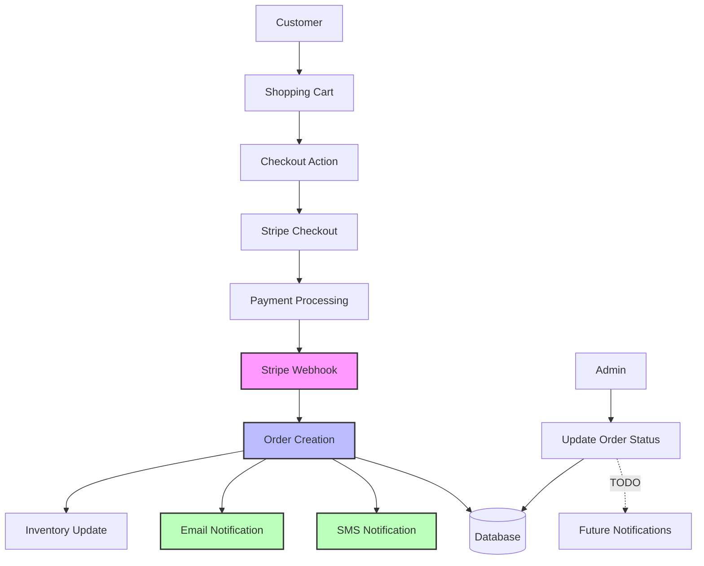
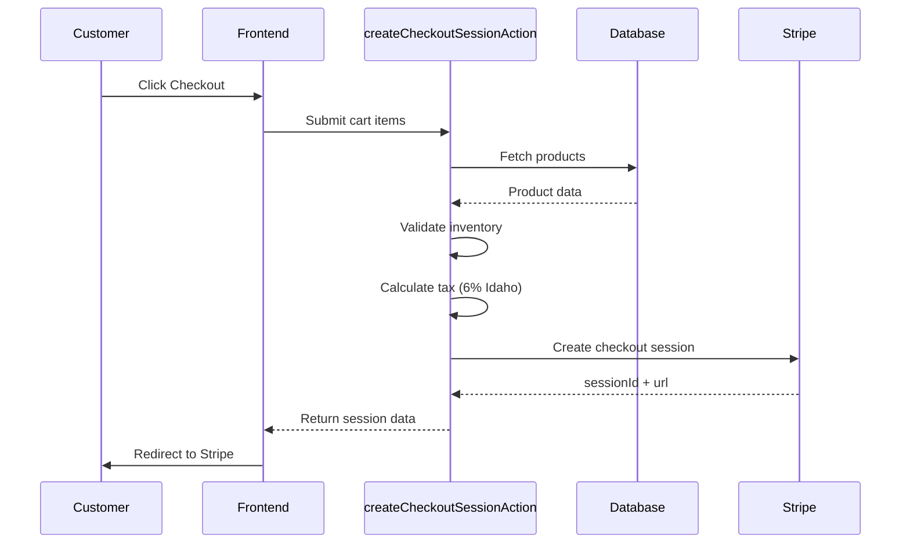
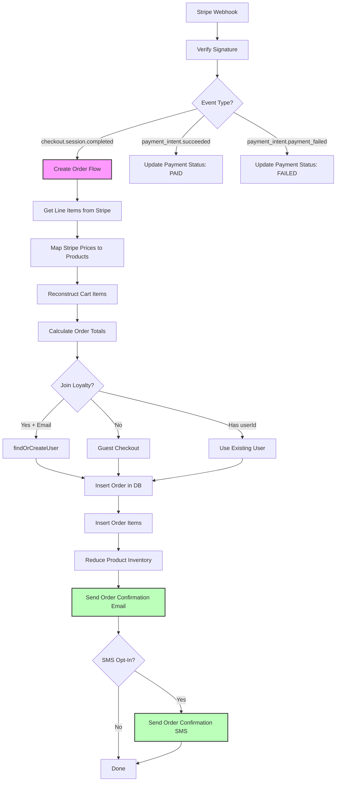
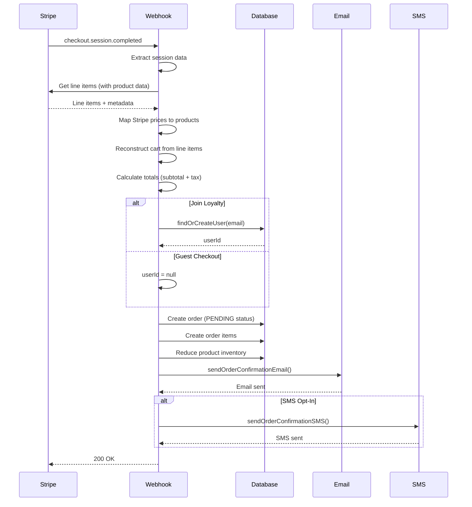
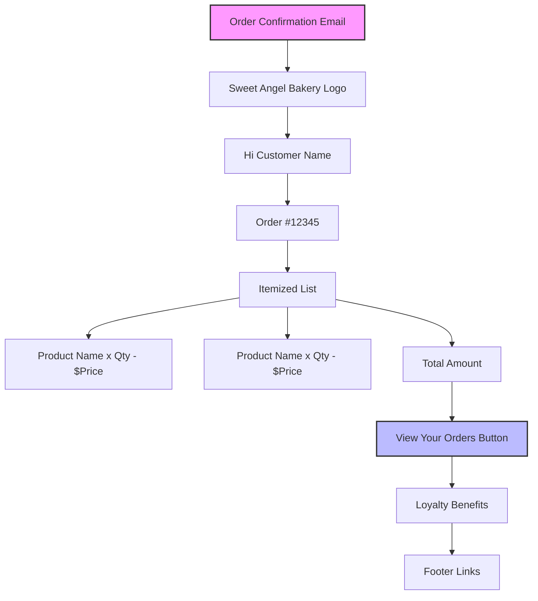
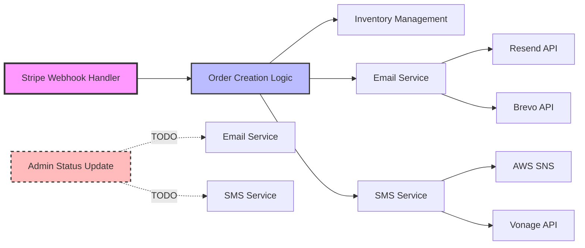
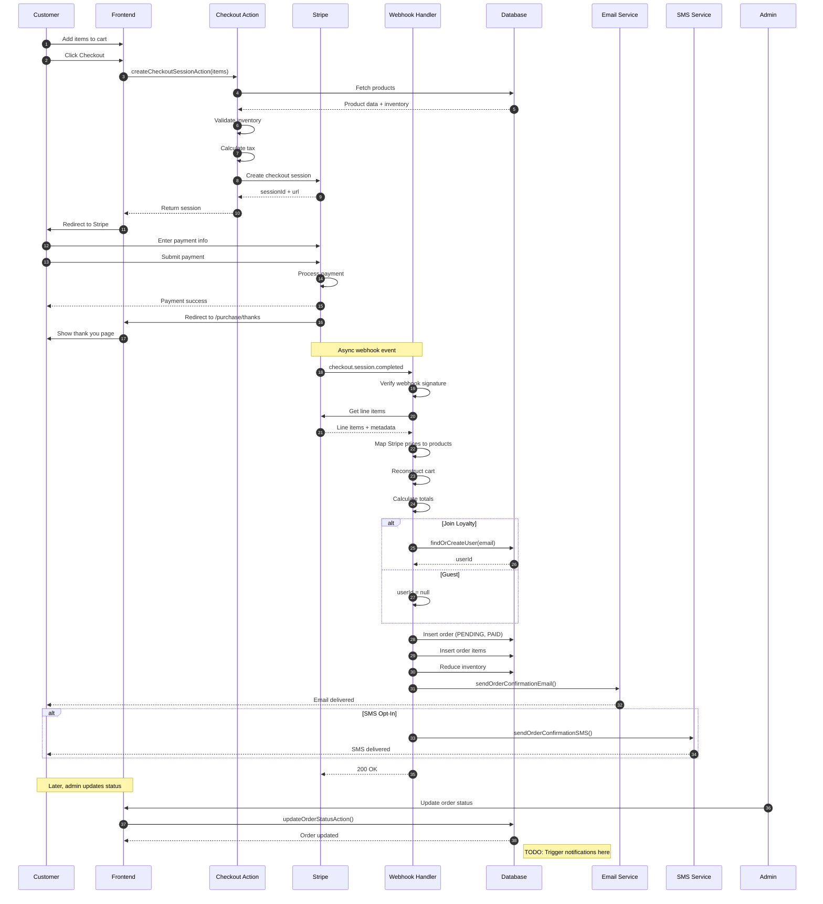

# Purchase Flows and Notification System Documentation

This document maps all purchase flows, payment processing, state changes, and notification points in the Sweet Angel Bakery application.

## Table of Contents

1. [Overview](#overview)
2. [Checkout & Payment Flow](#checkout--payment-flow)
3. [Stripe Webhook Processing](#stripe-webhook-processing)
4. [Email Notification System](#email-notification-system)
5. [SMS Notification System](#sms-notification-system)
6. [Order Status Management](#order-status-management)
7. [Database Schema](#database-schema)
8. [Notification Trigger Matrix](#notification-trigger-matrix)
9. [Key Files Reference](#key-files-reference)

---

## Overview

The application uses Stripe for payment processing, with asynchronous webhook handling for order creation and notifications. Email notifications use Resend/Brevo, and SMS notifications use AWS SNS/Vonage.

### High-Level Architecture



---

## Checkout & Payment Flow

### 1. Checkout Session Creation

**File**: `src/app/(storefront)/_actions/create-checkout-session.action.ts`

**Server Action**: `createCheckoutSessionAction`



**Input Validation**:
- Items: `{ productId, quantity, customizations, name, price }`
- Optional: `customerEmail, customerName, customerPhone, joinLoyalty, smsOptIn, userId`

**Process Steps**:
1. Fetch products from DB
2. Validate inventory (handles standard and variant quantities)
3. Build Stripe line items using `stripePriceId` (or create ad-hoc prices)
4. Calculate subtotal + Idaho sales tax (6%)
5. Create Stripe checkout session with metadata
6. Return `sessionId` and redirect `url`

**Tax Calculation**:
```typescript
// src/utils/tax.ts
export function calculateTax(subtotal: number): number {
  return Math.round(subtotal * TAX_RATE); // TAX_RATE = 0.06
}
```

**Key Details**:
- Inventory validation checks variant-specific quantities in JSON
- Uses variant `stripePriceId` if available, falls back to product-level
- All metadata stored for webhook processing

---

## Stripe Webhook Processing

### 2. Webhook Endpoint

**File**: `src/app/api/webhooks/stripe/route.ts`

**Route**: `POST /api/webhooks/stripe`



### 2.1 `checkout.session.completed` Handler

**Function**: `handleCheckoutSessionCompleted()`

This is the **critical order creation and notification trigger point**.

**Detailed Flow**:



**Order Creation Data**:
```typescript
{
  customerEmail: string;
  customerName: string;
  customerPhone: string | null;
  subtotal: number; // in cents
  tax: number; // in cents
  totalAmount: number; // in cents
  paymentStatus: 'paid';
  status: 'pending';
  stripePaymentIntentId: string;
  userId: string | null; // null for guest checkout
}
```

**Inventory Reduction**:
- **Standard products**: SQL atomic decrement `SET quantityAvailable = quantityAvailable - ?`
- **Size variants**: Update JSON in `customizations` field, then update product

**Notifications Sent**:
1. **Email**: Order confirmation with itemized list
2. **SMS**: Text confirmation (if `smsOptIn` is true)

---

## Email Notification System

### 3. Email Service

**File**: `src/utils/email.tsx`

**Supported Providers**:
- **Resend** (primary, via `RESEND_API_KEY`)
- **Brevo** (fallback, via `BREVO_API_KEY`)

**Environment Check**:
- Only sends emails in **production** (`NODE_ENV === 'production'`)
- Logs to console in development

### 3.1 Order Confirmation Email

**Function**: `sendOrderConfirmationEmail()`

**File**: `src/utils/email.tsx:188`

```typescript
export async function sendOrderConfirmationEmail({
  email,
  customerName,
  orderNumber,
  orderItems,
  totalAmount,
}: {
  email: string;
  customerName: string;
  orderNumber: string;
  orderItems: Array<{
    productName: string;
    quantity: number;
    price: number;
  }>;
  totalAmount: number;
})
```

**Template**: `src/react-email/order-confirmation.tsx`

**Email Content**:
- Subject: `"Order Confirmed - Sweet Angel Bakery #${orderNumber}"`
- Greeting: `"Hi ${customerName}!"`
- Order number display
- Itemized list with quantities and prices
- Total amount
- CTA: "View Your Orders" button → `/login`
- Loyalty program benefits mention

**Tags**: `["order-confirmation"]` (for analytics)

### 3.2 Email Template Structure



### 3.3 Other Email Types

**File**: `src/utils/email.tsx`

1. **`sendPasswordResetEmail()`** - Auth flow
2. **`sendVerificationEmail()`** - Email verification
3. **`sendTeamInvitationEmail()`** - Team management
4. **`sendMagicLinkEmail()`** - Passwordless storefront login

---

## SMS Notification System

### 4. SMS Service

**File**: `src/utils/sms.ts`

**Supported Providers**:
- **AWS SNS** (via `AWS_SNS_ACCESS_KEY` + `AWS_SNS_SECRET_KEY`)
- **Vonage/Nexmo** (via `VONAGE_API_KEY` + `VONAGE_API_SECRET`)

### 4.1 Order Confirmation SMS

**Function**: `sendOrderConfirmationSMS()`

**File**: `src/utils/sms.ts:118`

```typescript
export async function sendOrderConfirmationSMS({
  phoneNumber,
  customerName,
  orderNumber,
}: {
  phoneNumber: string;
  customerName: string;
  orderNumber: string;
})
```

**Message**:
```
Hi ${firstName}! Your Sweet Angel Bakery order #${orderNumber} has been confirmed. We'll notify you when it's ready. Reply STOP to opt out.
```

**Key Details**:
- Extracts first name from `customerName`
- Formats phone to E.164 format (`+15551234567`)
- **Non-blocking**: Doesn't fail order if SMS fails
- Only sends if `smsOptIn === true` in webhook

### 4.2 Future SMS Functions (Implemented but Not Used)

**File**: `src/utils/sms.ts`

1. **`sendOrderReadySMS()`** - Pickup notification
   ```
   Hi ${customerName}! Your order #${orderNumber} is ready for pickup at Sweet Angel Bakery. See you soon!
   ```

2. **`sendDropNotificationSMS()`** - Product drop early access
   ```
   Loyalty Member Early Access! ${dropName} drops ${earlyAccessTime}. Shop before the public at sweetangelbakery.com. Reply STOP to opt out.
   ```

### 4.3 Phone Number Formatting

**Helper**: `formatPhoneNumber()`

Converts various formats to E.164:
- `(555) 123-4567` → `+15551234567`
- `555-123-4567` → `+15551234567`
- Assumes US (+1) country code

---

## Order Status Management

### 5. Order Status Workflow

**File**: `src/db/schema.ts:155-232`

```mermaid
stateDiagram-v2
    [*] --> PENDING: Order created via webhook
    PENDING --> CONFIRMED: Admin confirms order
    CONFIRMED --> IN_PRODUCTION: Baking begins
    IN_PRODUCTION --> BAKING: In oven
    BAKING --> BAKED: Removed from oven
    BAKED --> COOLING: Cooling period
    COOLING --> DECORATING: Decoration in progress
    DECORATING --> PACKAGING: Final packaging
    PACKAGING --> READY_FOR_PICKUP: Available for customer
    PACKAGING --> OUT_FOR_DELIVERY: Out for delivery
    READY_FOR_PICKUP --> COMPLETED: Customer picked up
    OUT_FOR_DELIVERY --> COMPLETED: Delivered
    COMPLETED --> [*]

    PENDING --> CANCELLED
    CONFIRMED --> CANCELLED
    IN_PRODUCTION --> CANCELLED
    CANCELLED --> [*]

    note right of BAKED: TODO: Send email/SMS notification
    note right of READY_FOR_PICKUP: TODO: Send "ready for pickup" SMS
```

### 5.1 Admin Status Update Action

**File**: `src/app/(admin)/admin/_actions/orders.action.ts:156`

**Server Action**: `updateOrderStatusAction()`

```typescript
export const updateOrderStatusAction = createServerAction()
  .input(
    z.object({
      orderId: z.string(),
      status: z.enum(orderStatusTuple),
    })
  )
  .handler(async ({ input }) => {
    // Admin auth check
    // Update order status in DB
    // TODO: Trigger notifications based on status
  });
```

**Current Implementation**:
- Updates `orderTable.status`
- Updates `updatedAt` timestamp
- **No notifications sent** (marked as TODO)

**TODO Comment** (Line 175-179):
```typescript
// TODO: In the future, trigger email notification here based on status change
// For example:
// if (status === ORDER_STATUS.BAKED) {
//   await sendOrderStatusEmail(updatedOrder);
// }
```

### 5.2 Status Constants

**Order Fulfillment Status**:
```typescript
export const ORDER_STATUS = {
  PENDING: 'pending',
  CONFIRMED: 'confirmed',
  IN_PRODUCTION: 'in_production',
  BAKING: 'baking',
  BAKED: 'baked',
  COOLING: 'cooling',
  DECORATING: 'decorating',
  PACKAGING: 'packaging',
  READY_FOR_PICKUP: 'ready_for_pickup',
  OUT_FOR_DELIVERY: 'out_for_delivery',
  COMPLETED: 'completed',
  CANCELLED: 'cancelled',
} as const;
```

**Payment Status** (separate tracking):
```typescript
export const PAYMENT_STATUS = {
  PENDING: 'pending',
  PAID: 'paid',
  FAILED: 'failed',
  REFUNDED: 'refunded',
} as const;
```

---

## Database Schema

### 6. Key Tables

#### 6.1 Order Table

**File**: `src/db/schema.ts`

```typescript
export const orderTable = sqliteTable("order", {
  id: text("id").primaryKey().$defaultFn(() => createId("ord")),
  userId: text("user_id").references(() => userTable.id), // nullable
  customerEmail: text("customer_email").notNull(),
  customerName: text("customer_name").notNull(),
  customerPhone: text("customer_phone"),
  totalAmount: integer("total_amount").notNull(), // cents
  subtotal: integer("subtotal").notNull(), // cents
  tax: integer("tax").notNull(), // cents
  paymentStatus: text("payment_status").notNull(), // enum
  status: text("status").notNull(), // enum
  stripePaymentIntentId: text("stripe_payment_intent_id").unique(),
  fulfillmentType: text("fulfillment_type"), // 'pickup' | 'delivery'
  pickupTime: integer("pickup_time", { mode: "timestamp" }),
  deliveryAddress: text("delivery_address"),
  notes: text("notes"),
  createdAt: integer("created_at", { mode: "timestamp" }).notNull().$defaultFn(() => new Date()),
  updatedAt: integer("updated_at", { mode: "timestamp" }).notNull().$defaultFn(() => new Date()),
}, (table) => ({
  userIdIdx: index("order_user_id_idx").on(table.userId),
  paymentStatusIdx: index("order_payment_status_idx").on(table.paymentStatus),
  statusIdx: index("order_status_idx").on(table.status),
  createdAtIdx: index("order_created_at_idx").on(table.createdAt),
  stripePaymentIntentIdIdx: index("order_stripe_payment_intent_id_idx").on(table.stripePaymentIntentId),
}));
```

**Key Features**:
- Guest checkout supported (`userId` nullable)
- Stripe payment intent for idempotency
- Separate payment and fulfillment status tracking
- Indexed for common queries

#### 6.2 Order Item Table

```typescript
export const orderItemTable = sqliteTable("order_item", {
  id: text("id").primaryKey().$defaultFn(() => createId("oitem")),
  orderId: text("order_id").notNull().references(() => orderTable.id),
  productId: text("product_id").notNull().references(() => productTable.id),
  quantity: integer("quantity").notNull(),
  priceAtPurchase: integer("price_at_purchase").notNull(), // cents, locked
  customizations: text("customizations", { mode: "json" }), // JSON
}, (table) => ({
  orderIdIdx: index("order_item_order_id_idx").on(table.orderId),
  productIdIdx: index("order_item_product_id_idx").on(table.productId),
}));
```

**Key Features**:
- Price locked at purchase time
- Customizations stored as JSON (size, flavors, etc.)
- Foreign keys to order and product

#### 6.3 Product Table (Inventory)

```typescript
export const productTable = sqliteTable("product", {
  // ... other fields
  quantityAvailable: integer("quantity_available").notNull().default(0),
  customizations: text("customizations", { mode: "json" }), // size_variants
  stripePriceId: text("stripe_price_id"), // Stripe integration
  isNewFlavor: integer("is_new_flavor", { mode: "boolean" }).default(false),
  newFlavorUntil: integer("new_flavor_until", { mode: "timestamp" }),
});
```

**Inventory Management**:
- **Standard products**: Direct `quantityAvailable` field
- **Size variants**: JSON in `customizations.size_variants`
  ```json
  {
    "size_variants": [
      { "size": "6-inch", "stripePriceId": "price_xxx", "quantityAvailable": 10 },
      { "size": "9-inch", "stripePriceId": "price_yyy", "quantityAvailable": 5 }
    ]
  }
  ```

---

## Notification Trigger Matrix

### 7. Current vs Future Notifications

| Event | Current Behavior | Email | SMS | Status Change |
|-------|-----------------|-------|-----|---------------|
| **Payment Received** | ✅ Implemented | ✅ Order Confirmation | ✅ Order Confirmed | `paymentStatus: 'paid'` |
| **Order Created** | ✅ Implemented | ✅ (same as above) | ✅ (same as above) | `status: 'pending'` |
| Order → CONFIRMED | ❌ No notification | ❌ TODO | ❌ TODO | Admin action |
| Order → BAKED | ❌ No notification | ❌ TODO | ❌ TODO | Admin action |
| Order → READY_FOR_PICKUP | ❌ No notification | ❌ TODO | ✅ Function exists (not called) | Admin action |
| Order → COMPLETED | ❌ No notification | ❌ TODO | ❌ TODO | Admin action |
| Payment Failed | ✅ Status updated | ❌ No notification | ❌ No notification | `paymentStatus: 'failed'` |
| New Flavor Drop | ❌ Not implemented | ❌ TODO | ✅ Function exists | Manual trigger |
| Loyalty Early Access | ❌ Not implemented | ❌ TODO | ✅ Function exists | Manual trigger |

### 7.1 Implemented Notification Functions

**Active**:
- `sendOrderConfirmationEmail()` ← Called from webhook
- `sendOrderConfirmationSMS()` ← Called from webhook

**Available (not called)**:
- `sendOrderReadySMS()` ← Ready for integration
- `sendDropNotificationSMS()` ← Ready for integration

---

## Key Files Reference

### 8. File Locations

| File Path | Purpose | Lines of Note |
|-----------|---------|---------------|
| `src/app/api/webhooks/stripe/route.ts` | **PRIMARY ORDER CREATION** | 1-500 (webhook handler) |
| `src/app/(storefront)/_actions/create-checkout-session.action.ts` | Initiate Stripe checkout | 1-150 |
| `src/app/(admin)/admin/_actions/orders.action.ts` | Admin order management | 156-179 (status update TODO) |
| `src/utils/email.tsx` | Email service (Resend/Brevo) | 188 (order confirmation) |
| `src/utils/sms.ts` | SMS service (AWS SNS/Vonage) | 118 (order confirmation) |
| `src/react-email/order-confirmation.tsx` | Order email template | Full file |
| `src/db/schema.ts` | Status enums + DB schema | 155-232 (statuses) |
| `src/app/(storefront)/purchase/thanks/page.tsx` | Post-purchase thank you | 1-200 |
| `src/app/(admin)/admin/orders/[orderId]/page.tsx` | Admin order detail | Full file |
| `src/app/(storefront)/profile/page.tsx` | Customer order history | Full file |

### 8.1 Critical Integration Points



### 8.2 Environment Variables Required

**Email**:
- `RESEND_API_KEY` (primary)
- `BREVO_API_KEY` (fallback)

**SMS**:
- `AWS_SNS_ACCESS_KEY` + `AWS_SNS_SECRET_KEY` (primary)
- `VONAGE_API_KEY` + `VONAGE_API_SECRET` (fallback)

**Stripe**:
- `STRIPE_SECRET_KEY`
- `STRIPE_WEBHOOK_SECRET`

---

## Complete Sequence Diagram

### 9. End-to-End Purchase Flow



---

## Future Enhancements

### 10. Planned Notification Improvements

Based on TODO comments in the codebase:

1. **Order Status Notifications** (`src/app/(admin)/admin/_actions/orders.action.ts:175-179`)
   - Trigger email/SMS when order status changes
   - Suggested statuses to notify:
     - `BAKED` → "Your order is baked and cooling"
     - `READY_FOR_PICKUP` → "Your order is ready!"
     - `OUT_FOR_DELIVERY` → "Your order is on the way"

2. **New Flavor Drops**
   - Use existing `sendDropNotificationSMS()` function
   - Trigger based on `isNewFlavor` and `newFlavorUntil` fields
   - Email template needed

3. **Loyalty Early Access**
   - Notify loyalty members before public drop
   - Use existing `sendDropNotificationSMS()` function
   - Email template needed

4. **Order Reminder Notifications**
   - Remind customers about pending pickup
   - Time-based triggers (e.g., 30 mins before pickup time)

---

## Troubleshooting Guide

### 11. Common Issues

**Issue**: Orders created but no email sent
- **Check**: Email provider API keys in environment
- **Check**: `NODE_ENV === 'production'` (dev mode only logs)
- **File**: `src/utils/email.tsx:188`

**Issue**: SMS not received
- **Check**: Phone number format (must be E.164)
- **Check**: SMS provider credentials
- **Check**: `smsOptIn` flag in checkout metadata
- **File**: `src/utils/sms.ts:118`

**Issue**: Inventory not reduced
- **Check**: Webhook signature validation passed
- **Check**: Product has correct `stripePriceId` or variant mapping
- **File**: `src/app/api/webhooks/stripe/route.ts:300-350`

**Issue**: Duplicate orders created
- **Check**: Webhook idempotency handling
- **Check**: `stripePaymentIntentId` unique constraint
- **File**: `src/app/api/webhooks/stripe/route.ts`

---

## Testing Checklist

### 12. Purchase Flow Testing

- [ ] Standard product purchase (no variants)
- [ ] Product with size variants purchase
- [ ] Guest checkout (no loyalty signup)
- [ ] Loyalty signup during checkout
- [ ] SMS opt-in during checkout
- [ ] Email notification received
- [ ] SMS notification received (if opted in)
- [ ] Inventory correctly reduced
- [ ] Order appears in admin dashboard
- [ ] Order appears in customer profile (if logged in)
- [ ] Stripe webhook idempotency (retry same event)
- [ ] Failed payment handling
- [ ] Admin status updates
- [ ] Thank you page displays correctly

---

## Glossary

**CUID2**: Collision-resistant Unique Identifier (v2) - used for all IDs with prefixes
**E.164**: International phone number format (`+15551234567`)
**Idempotency**: Ensuring the same webhook event doesn't create duplicate orders
**Line Item**: Individual product in a Stripe checkout session
**Metadata**: Custom data attached to Stripe objects (checkout session, payment intent)
**Webhook**: Server-to-server HTTP callback from Stripe when events occur

---

*Last Updated: 2025-10-22*
*Maintainer: Development Team*
